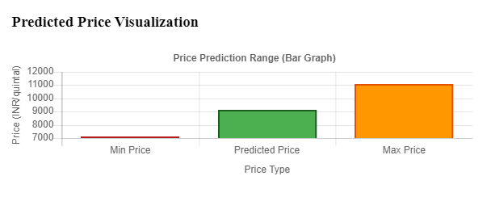
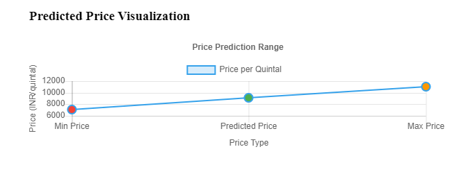

# Microservices-AI

AI-Microservices for Krishi-Unnati-Project

## Overview

This repository contains a collection of microservices designed
to enhance the Krishi Unnati Project using AI technologies.
Each microservice focuses on a specific aspect of agriculture,
providing farmers with tools and insights to improve their productivity and sustainability.

## Microservices:

1. **Crop Price Prediction Service**
    - Predicts future crop prices based on historical data and market trends.
    - Technologies: Python, FastAPI, Scikit-learn
    - Model: RandomForestRegressor
    - Data Source: Historical crop price data from Indian agricultural markets(approx).
    - Endpoint: `/`
        - For basic home API info.
        - Example Response:
      ```json
         {
              "name": "Agricultural Price Prediction API",
              "version": "1.0.0",
              "description": "AI-powered price estimation for Indian agricultural products",
              "endpoints": {
                    "health": "/health",
                    "predict": "/predict",
                    "docs": "/docs",
                    "products": "/products"
              }
        }
      ```

** **

- Endpoint: `/predict`
- Input: JSON object with crop details (product, quality, season, state, quantity, market_distance, organic_certified)
- Output: Predicted price along with confidence intervals.
- Input:
    - Example JSON object containing:
       ```json
         {
               "product": "cotton",    // Product-commodity (type) name:
               "quality": "high",      // Quality of crop: high/medium/low
               "season": "kharif",     // Crop-yield season: rabi/kharif/zaid 
               "state": "maharashtra", // State within India or certain range
               "quantity": 20,         // Quantity in quintal
               "market_distance": 50,  // Market distance in Km
               "organic_certified": 1  // isOrganicCertified ? 1 -> True, 0 -> False
         }
       ```

- Output:
    - Example Predicted price:
      ```json
         {
               "success": true,
               "message": "Price prediction successful",
               "prediction": {
                   "price_per_quintal": 9107.89,
                   "min_price": 7135.57,
                   "max_price": 11080.21,
                   "confidence": 85.56329165288199
               },
               "error": null
         }
       ```
- Visualizations:
    - This is for quick analysis of historical price trends for that uploaded crop.

        - Example Visualization Output: (Bar Chart)  
          

        - Example Visualization Output: (Line Chart)  
                 

- Other API Endpoints:
    - `/health`: Health check endpoint
    - `/products`: List of supported products
    - `/docs`: API documentation endpoint (Swagger UI)

****

- Other Microservices (To be added soon)
    - Crop Recommendation Service
    - Market Demand Analysis Service